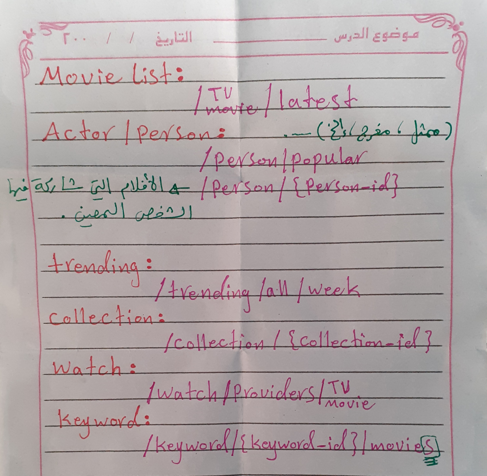

# Movies ReactJS App

A responsive and visually appealing movie library application built with **ReactJS**. The app provides users with an interactive platform to browse, search, and explore movies with detailed information. This project is a great example of modern React development with API integration.

## Features, Technologies Used, Getting Started, Deployment, Directory Structure, Future Enhancements, Contributing, License, and Acknowledgments

- **Home Page**: Displays trending and featured movies.
- **Search Functionality**: Find movies by title, actors, genre, year, and more.
- **Movie Details Page**: Comprehensive details about each movie, including release date, runtime, and rating.
- **Dark/Light Mode**: Seamless theme switching based on user preference.
- **Pagination**: Navigate between movie lists effortlessly.
- **Responsive Design**: Optimized for desktop, tablet, and mobile devices.

- **Frontend**: ReactJS, React Router, React Bootstrap, Axios.
- **Styling**: CSS, Bootstrap, custom animations.
- **API**: Integrated with [The Movie Database API](https://www.themoviedb.org/) for movie data.

- **Prerequisites**: Before running the project, ensure you have the following installed:
  - Node.js
  - npm or yarn

- **Installation**:
  1. Clone the repository:
     ```bash
     git clone https://github.com/rebhi-2002/movies-reactjs.git
     cd movies-reactjs
     ```
  2. Install dependencies:
     ```bash
     npm install
     ```
  3. Start the development server:
     ```bash
     npm start
     ```
  4. Open your browser at http://localhost:3000.

- **Deployment**: To build and deploy the app:
   ```bash
   npm run build

This will create a production-ready build in the build folder.

Directory Structure

```
movies-reactjs/
├── public/          # Public assets and index.html
├── src/
│   ├── components/  # Reusable React components
│   ├── pages/       # Page-level components (e.g., Home, MovieDetails)
│   ├── styles/      # CSS and custom styles
│   ├── utils/       # Utility functions and helpers
│   └── App.js       # Main app component
├── package.json     # Project dependencies
└── README.md        # Project documentation
```

## Future Enhancements, Contributing, License, and Acknowledgments

- **Future Enhancements**:
  - User authentication for bookmarking favorite movies.
  - Advanced filtering and sorting options.
  - Integration with Firebase for user data management.
  - Offline functionality using service workers.



- **Contributing**: Contributions are welcome! Feel free to fork the repository and create a pull request for any improvements or fixes.

- **License**: This project is licensed under the MIT License. See the LICENSE file for details.

- **Acknowledgments**:
  - The Movie Database API for providing movie data.
  - Open-source contributors for making libraries and tools available.

<!-- # Getting Started with Create React App

This project was bootstrapped with [Create React App](https://github.com/facebook/create-react-app).

## Available Scripts

In the project directory, you can run:

### `npm start`

Runs the app in the development mode.\
Open [http://localhost:3000](http://localhost:3000) to view it in your browser.

The page will reload when you make changes.\
You may also see any lint errors in the console.

### `npm test`

Launches the test runner in the interactive watch mode.\
See the section about [running tests](https://facebook.github.io/create-react-app/docs/running-tests) for more information.

### `npm run build`

Builds the app for production to the `build` folder.\
It correctly bundles React in production mode and optimizes the build for the best performance.

The build is minified and the filenames include the hashes.\
Your app is ready to be deployed!

See the section about [deployment](https://facebook.github.io/create-react-app/docs/deployment) for more information.

### `npm run eject`

**Note: this is a one-way operation. Once you `eject`, you can't go back!**

If you aren't satisfied with the build tool and configuration choices, you can `eject` at any time. This command will remove the single build dependency from your project.

Instead, it will copy all the configuration files and the transitive dependencies (webpack, Babel, ESLint, etc) right into your project so you have full control over them. All of the commands except `eject` will still work, but they will point to the copied scripts so you can tweak them. At this point you're on your own.

You don't have to ever use `eject`. The curated feature set is suitable for small and middle deployments, and you shouldn't feel obligated to use this feature. However we understand that this tool wouldn't be useful if you couldn't customize it when you are ready for it.

## Learn More

You can learn more in the [Create React App documentation](https://facebook.github.io/create-react-app/docs/getting-started).

To learn React, check out the [React documentation](https://reactjs.org/).

### Code Splitting

This section has moved here: [https://facebook.github.io/create-react-app/docs/code-splitting](https://facebook.github.io/create-react-app/docs/code-splitting)

### Analyzing the Bundle Size

This section has moved here: [https://facebook.github.io/create-react-app/docs/analyzing-the-bundle-size](https://facebook.github.io/create-react-app/docs/analyzing-the-bundle-size)

### Making a Progressive Web App

This section has moved here: [https://facebook.github.io/create-react-app/docs/making-a-progressive-web-app](https://facebook.github.io/create-react-app/docs/making-a-progressive-web-app)

### Advanced Configuration

This section has moved here: [https://facebook.github.io/create-react-app/docs/advanced-configuration](https://facebook.github.io/create-react-app/docs/advanced-configuration)

### Deployment

This section has moved here: [https://facebook.github.io/create-react-app/docs/deployment](https://facebook.github.io/create-react-app/docs/deployment)

### `npm run build` fails to minify

This section has moved here: [https://facebook.github.io/create-react-app/docs/troubleshooting#npm-run-build-fails-to-minify](https://facebook.github.io/create-react-app/docs/troubleshooting#npm-run-build-fails-to-minify) -->
